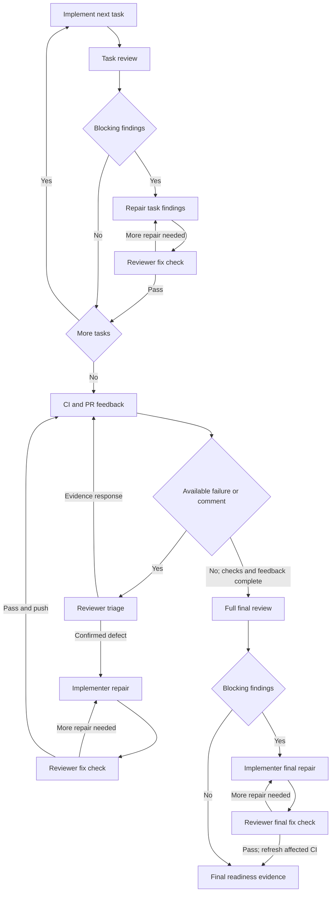
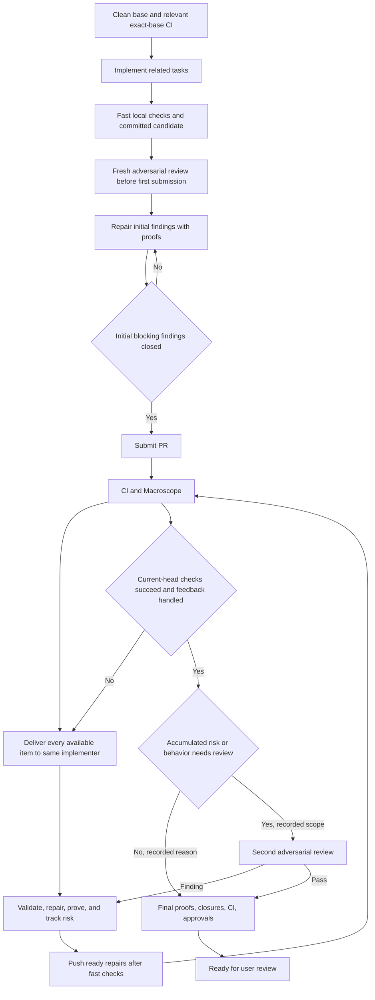
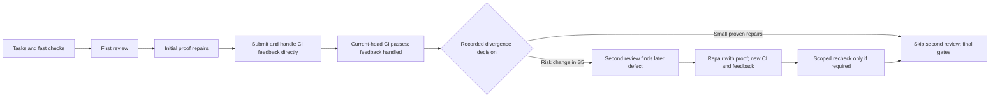

# Delivery workflow and portable plugin support

This workflow is applied in Code Factory 0.1.9. One persistent implementer
owns a lane from implementation through PR feedback. Independent review
searches for defects with fresh context. Routine repairs close with useful
executable proof.

The historical baseline is version 0.1.8 at commit
`311ffaa5241387649eee76cb56ebabf8503c2f84`. That workflow used four task
implementation turns and four task reviews in each sample, then a full final
review. Defects added repair validation and reviewer fix-check turns. CI
comments went through reviewer triage. The scenarios below compare that
historical flow with the applied flow. The document keeps the historical
counts and states all new scheduling assumptions.



## Review and feedback order

1. Complete related tasks and fast, cheap local checks. Use format, focused
   lint or compile, small tests, and one-off proofs. Never run the full
   repository CI suite as local checks. Keep slow required proofs PENDING.
2. Always finish one fresh adversarial review before first PR submission.
   Validate its findings and repair them. Routine repairs close with proof.
   Run useful executable closure checks before submission. Record the
   reviewed candidate, repaired candidate, and proofs. Do not submit with
   initial blocking findings open. Track independent closure needs and
   major repair divergence for the post-CI decision. Do not dispatch another
   adversarial review before CI settles. If useful proof is impossible,
   request an owner decision and keep the item open.
3. Submit the PR. Send all CI, Macroscope, and human feedback directly to
   the same implementer as it becomes available. Do not wait for a batch or
   all checks. Do not add reviewer triage or mid-loop repair reviews. Track
   changed risk and pending independent closure scopes. Push ready repairs
   after fast checks, then collect new current-head results.
4. Only after current-head CI and Macroscope checks succeed and
   feedback is handled, assess total behavior and risk changes from the
   first review, including repairs to its findings. Record whether a second
   adversarial review is required,
   why, and its scope. Line count does not decide it. Small repairs that
   preserve contracts and have useful proofs can skip it.
5. A second-review finding returns to the implementer and CI. Finish new
   current-head checks and handle feedback before a needed scoped recheck.
   Do not restart full reviews after every push.

Security or authorization, ownership, cancellation, concurrency, public API,
stored data formats, shared contracts, substantial new behavior, or inadequate
executable closure can require the second review. A required independent
closure flag must pass or receive an approved disposition.



## Thread closure and the post-CI gate

A repair can push after fast checks. Resolve its thread only when its named
closure proof and any required independent scoped review pass. Keep threads
open when they wait solely for the deferred post-CI review. Other slow checks
still gate readiness.

For the post-CI gate, **handled** means validated, dispositioned, and repaired
with available proofs. An identified thread can remain open solely for the
deferred review. An owner decision, blocking defect, missing proof, incomplete
source, or unhandled new comment cannot pass this gate. Refresh the head and
sources. New feedback returns the lane to validation. This avoids a cycle in
which review waits for thread closure and thread closure waits for review.

Replies use the validated head and last comment version. GitHub has no
compare-and-swap parameter for thread resolution. Pre-mutation checks are
best effort. Leave newer or uncertain items open and collect them again.

```mermaid
sequenceDiagram
    participant C as CI or Macroscope
    participant I as Persistent implementer
    participant O as Orchestrator
    participant R as Independent reviewer
    C-->>I: Each available item, source version, and evidence
    I->>I: Validate, repair, and run useful proofs
    I-->>C: Push ready repair after fast checks
    C-->>I: New current-head results and comments
    C-->>O: All current-head checks succeeded
    I-->>O: Feedback handled; deferred closure scopes named
    O->>O: Assess accumulated divergence from first review
    opt Second review required
        O->>R: Candidate, changed risk, scope, and proofs
        R-->>I: Findings or pass
        Note over I,C: A finding returns to repair and CI before scoped recheck
    end
    I-->>C: Resolve eligible threads after proof and required review
```

These arrows show logical routing. Native agents use native messages. An
active CLI session that cannot accept messages uses a durable run-directory
inbox. It reads immutable item versions at safe checkpoints and before
commit, push, and final report. Idle sessions resume with the inbox path.
Atomic per-item writes and version acknowledgements preserve arrivals and
prevent duplicate handling. Recovery reconciles git and external actions
before repeats. No daemon, busy polling, or interruption is needed. See
[the inbox protocol](../skills/executing-plans/references/feedback-inbox.md).
A shared stack has one push owner; lanes supply commits and replies to it.

## Sample scenarios

Each scenario has four related tasks in one lane and one PR. Hold its listed
defects and repair attempts constant for this arithmetic. `I` counts
implementer turns. `R` counts independent reviewer turns. `H` counts dispatch
and result handoffs: `2 × (I + R)`. As in the historical document, it excludes
CI runtime, collectors, commands, status calls, replies, and session setup.
These are scheduling examples, not measured token savings or catch rates.

The historical arithmetic is `I = T + L + B + F` and
`R = T + L + Q + B + 1 + F`. `T` is task implementation turns and task
reviews. `L` is local repair turns, each with a reviewer fix check. `Q` is
CI feedback triage turns. `B` is CI repair turns, each with a reviewer fix
check. `F` is repair turns after the full final review, each with a reviewer
fix check. The `1` is that full final review. In all samples, `T = 4`.
Several defects can share one turn; count turns and attempts, not defects.


| Scenario | Assumptions | Historical I / R / H | Applied I / R / H |
| --- | --- | ---: | ---: |
| S1 Clean PR | No defects. Post-CI assessment finds no divergence. | 4 / 5 / 18 | 1 / 1 / 4 |
| S2 One batch | Five initial defects close in one proof repair. Two CI defects arrive together and close in one proof repair. All repairs preserve contracts. Second review is skipped with a recorded reason. | 6 / 8 / 28 | 3 / 1 / 8 |
| S3 Repeat and late | One initial defect needs three attempts. Three CI defects arrive separately. Useful proofs close all repairs; no material risk change remains. | 10 / 14 / 48 | 7 / 1 / 16 |
| S4 False reports | Three incorrect CI claims arrive together. One evidence turn handles them. No code change or second review. | 4 / 6 / 20 | 2 / 1 / 6 |
| S5 Second review finding | Two initial defects and one CI defect close with proof. Accumulated risk requires a post-CI second review. It finds one later defect. Its repair has useful proof and needs no independent closure recheck. | 7 / 9 / 32 | 4 / 2 / 12 |

S2 can need another turn or push if the CI items arrive separately. It still
starts the first actionable repair promptly. S5 assumes the risk decision
requires a second review and that review finds the listed defect. If its
repair needs independent closure, add one scoped recheck after new CI passes:
one R turn and two H handoffs. If the second review is skipped, this example
does not guarantee a source for that later finding. CI, the first review, or
a human might find it, or it might be missed. Measure this tradeoff in trials.



## Baseline and final evidence

Preflight records clean status and the exact base commit. Reuse relevant
completed CI on that commit. Run only new or one-off commands, uncovered
checks, or checks needed to resolve a baseline gap. Do not run every plan
proof up front. New behavior can be NOT APPLICABLE on the base.

Final proof records name requirements, actual commits, commands or named
tests, expected and observed results, and raw output. Earlier green CI does
not prove new code. Pending required CI, unresolved blocking findings,
missing proofs, and missing approvals prevent readiness. A later push needs
current-head CI and affected proofs again.

## External design ideas

[Bun's account](https://bun.com/blog/bun-in-rust) describes independent bug
search followed by repairs and compiler or test failures used as work queues.
It informs the feedback routing. Its existing test suite and human monitoring
do not establish equal defect detection for this workflow. Two independent
critics can share the first review phase for complex work with separate
checkouts and distinct focus. Each reports directly without reviewing the
other's findings.

## Portable package

Root `mcp.json` bundles the Ref Plans HTTPS endpoint. Claude's `.mcp.json`
binds `REF_API_KEY` to `x-ref-api-key`. Skill UI metadata names the skills,
summaries, and prompts. `working-with-ref` declares the Plans dependency.
Other skills can use local plans.

The portable format has no environment header expansion. The host must bind
a secret; discovery alone cannot authenticate. See [the README](../README.md)
for the known native Codex binding. App and Cloud authenticated installation
still need an end-to-end check. Do not assert that a shell variable reaches
a host-managed MCP connection. No auth service or user configuration change
is part of this package. Run state uses a writable host path, not the
installed plugin directory.

Package sources checked on 2026-09-30:
[Build skills](https://learn.chatgpt.com/docs/build-skills),
[Build plugins](https://learn.chatgpt.com/docs/build-plugins?site_locale=en),
[Package plugins](https://developers.openai.com/plugins/build/plugins?site_locale=en),
[Skill dependencies](https://developers.openai.com/plugins/build/skills), and
[Portable MCP format](https://agent-plugins.org/plugin-authors/mcp-servers).

## Trial criteria

Use comparable PRs. Record role turns, measured tokens when available,
elapsed time, check time, accepted and rejected findings, repair attempts,
first detection phase, and later missed defects. Record the post-CI second
review decision, scope, and result. Keep review cost separate from CI time.
Do not infer speed or catch rate from scenario arithmetic. Improve proof for
repair classes that escape it. Do not add a review loop for every CI comment.
